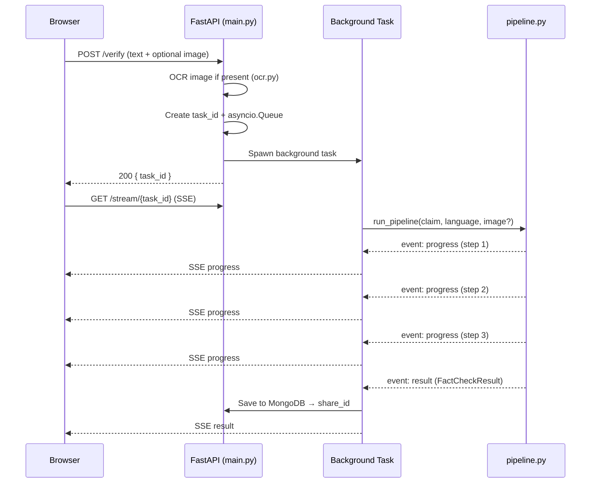
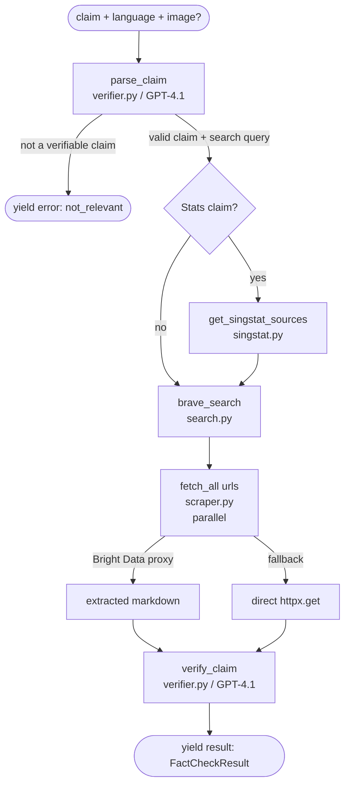
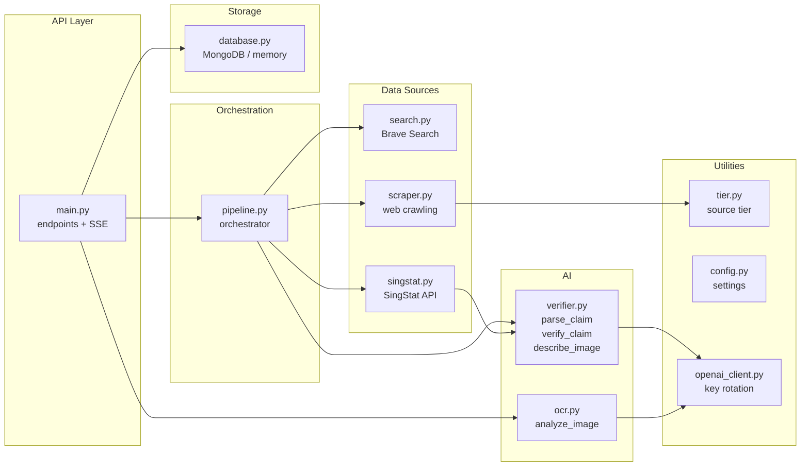
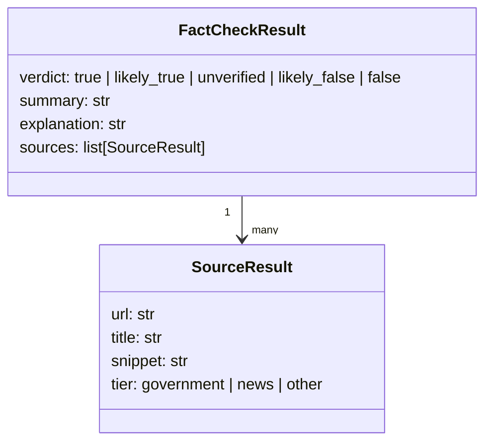

# Architecture

## Overview

TruthCheckSG is a FastAPI application that verifies factual claims using web search and GPT-4.1. A claim comes in via HTTP, gets searched, scraped, and analysed, then the result streams back to the browser over SSE and is persisted to MongoDB for sharing.

## Request flow



## Pipeline



After the pipeline completes the result is written to MongoDB (`database.py`) and a `share_id` is returned so the result can be retrieved at `GET /share/{share_id}`.

## Component map



## Data model



## External services

| Service | Purpose | Fallback |
|---------|---------|---------|
| OpenAI GPT-4.1 | Claim parsing, verification, image description | None — required |
| Brave Search API | Web search | None — required |
| Bright Data unlocker | Proxy to bypass bot detection | Direct `httpx.get()` |
| MongoDB | Result persistence + image storage | In-memory dict (tests only) |
| SingStat API | Official Singapore statistics | Skipped (optional route) |

## Multimodal support

- **Image + text**: text is used as the claim; image bytes are passed to GPT-4.1 vision as additional context.
- **Image only**: OCR via `analyze_image()` extracts text to form the claim; a one-sentence description is captured for the share page.

## Frontend

The UI (`static/app.js`, `templates/index.html`) is a vanilla JS state machine with four states: `input → loading → result | error`. Progress is driven by the SSE stream. i18n JSON is injected server-side at render time; four languages are supported (EN, 中文, BM, தமிழ்). Past checks are stored in `localStorage`.

## Deployment

```bash
docker compose up -d        # starts MongoDB on port 27017
uv run python run_local.py  # FastAPI with hot-reload on :8001
```

Production runs in Docker (multi-stage build, Python 3.13, port 8000).
